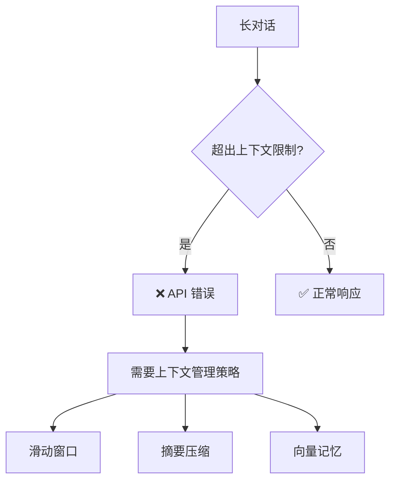
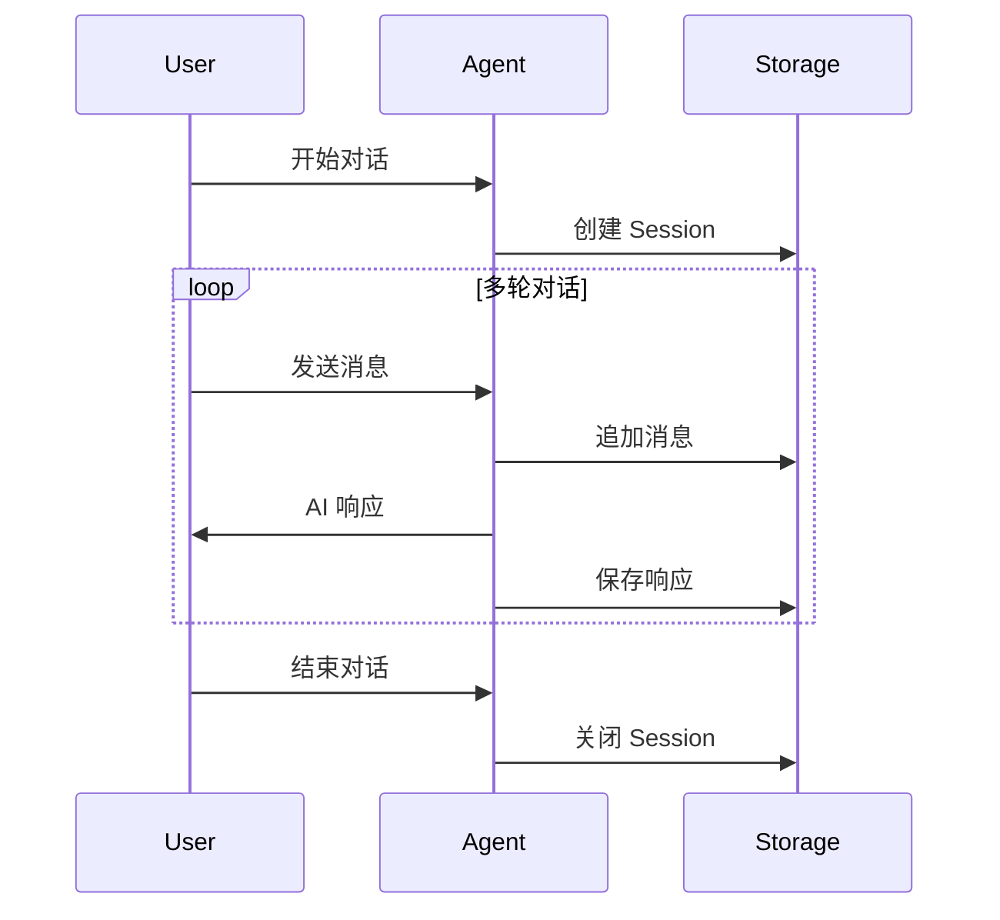
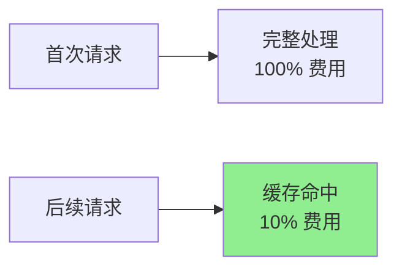
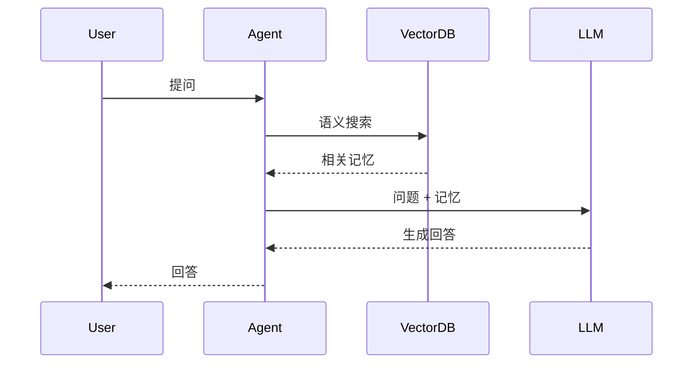
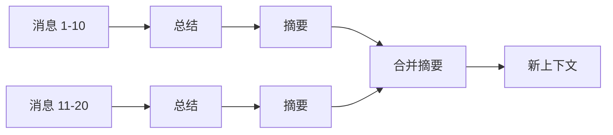

# 01. 概念讲解 - 上下文与记忆管理

> 让你的 Agent 拥有"记忆"，实现真正的连续对话

## 🎯 本章目标

- 理解 LLM 的上下文窗口限制
- 掌握会话管理的核心原理
- 了解 Prompt Caching 的优化机制
- 学习向量记忆系统的架构

---

## 1. 上下文窗口 (Context Window)

### 1.1 什么是上下文窗口？

**上下文窗口**是 LLM 一次性能处理的最大 token 数量。对于 Claude 3.5 Sonnet：

```
总上下文窗口 = 200,000 tokens
输入 tokens + 输出 tokens ≤ 200,000
```

### 1.2 Token 计算

不同内容的 token 消耗：

| 内容类型 | 示例 | 约估 Tokens |
|---------|------|-------------|
| 英文文本 | "Hello, world!" | ~3 tokens |
| 中文文本 | "你好，世界！" | ~6 tokens |
| 代码 | `def hello(): pass` | ~8 tokens |
| JSON | `{"name": "Alice"}` | ~7 tokens |

**经验法则**：
- 英文：1 token ≈ 4 字符
- 中文：1 token ≈ 1.5 字符

### 1.3 上下文窗口的挑战



**常见问题**：
1. **Token 溢出**：对话历史过长导致超限
2. **成本高昂**：每次都发送完整历史
3. **响应变慢**：处理大量上下文耗时

---

## 2. Session 管理

### 2.1 什么是 Session？

**Session（会话）**是一次完整的对话周期，包含：
- 唯一的会话 ID
- 完整的消息历史
- 会话元数据（创建时间、用户信息等）

### 2.2 会话的生命周期



### 2.3 Session 数据结构

```python
{
    "session_id": "sess_abc123",
    "created_at": "2024-01-06T10:00:00Z",
    "updated_at": "2024-01-06T10:15:00Z",
    "metadata": {
        "user_id": "user_001",
        "topic": "技术咨询"
    },
    "messages": [
        {
            "role": "user",
            "content": "什么是 Agent？"
        },
        {
            "role": "assistant",
            "content": "Agent 是能够自主执行任务的 AI 系统..."
        }
    ]
}
```

### 2.4 持久化策略

| 方案 | 优点 | 缺点 | 适用场景 |
|------|------|------|----------|
| **JSON 文件** | 简单易用 | 并发性能差 | 学习、小规模应用 |
| **SQLite** | 结构化查询 | 单机限制 | 中小型应用 |
| **Redis** | 高性能 | 需要额外服务 | 生产环境 |
| **PostgreSQL** | 强大功能 | 复杂度高 | 企业级应用 |

---

## 3. Prompt Caching

### 3.1 什么是 Prompt Caching？

**Prompt Caching** 允许缓存 prompt 的固定部分，避免重复计算：



### 3.2 缓存机制

Claude API 自动缓存 **前缀内容** (prefix content)：

```python
# 第一次请求
messages = [
    {
        "role": "user",
        "content": [
            {
                "type": "text",
                "text": "【大量文档内容 - 会被缓存】",
                "cache_control": {"type": "ephemeral"}
            },
            {
                "type": "text", 
                "text": "问题：这个文档讲了什么？"  # 不缓存
            }
        ]
    }
]

# 后续请求 - 缓存命中！
messages = [
    {
        "role": "user",
        "content": [
            {
                "type": "text",
                "text": "【相同的大量文档 - 从缓存读取】",
                "cache_control": {"type": "ephemeral"}
            },
            {
                "type": "text",
                "text": "问题：文档的第三章讲什么？"  # 新问题
            }
        ]
    }
]
```

### 3.3 缓存生命周期

- **TTL（Time To Live）**：5 分钟
- **最小缓存大小**：1024 tokens
- **自动失效**：缓存内容变化时

### 3.4 成本分析

假设文档 10,000 tokens，回答 100 个问题：

| 方案 | Input Tokens | 成本（按 $3/M tokens） |
|------|--------------|------------------------|
| **不使用缓存** | 10,000 × 100 = 1M | $3.00 |
| **使用缓存** | 10,000 + (1,000 × 99) = 109K | $0.33 |

**节省 90% 成本！** 🎉

### 3.5 适用场景

✅ **适合使用 Caching**：
- 问答机器人（固定文档）
- 代码审查（完整代码库）
- 客服助手（产品手册）

❌ **不适合使用 Caching**：
- 每次内容都变化
- 单次对话（无重复）
- Token 数太少（< 1024）

---

## 4. 向量记忆 (Vector Memory)

### 4.1 为什么需要向量记忆？

传统数据库：**精确匹配**
```sql
SELECT * FROM memories WHERE content = '什么是 Agent'
-- ❌ 找不到："Agent 是什么" （表述不同）
```

向量数据库：**语义相似**
```python
query = "Agent 是什么"
results = vector_db.search(query, top_k=3)
# ✅ 找到：
# - "什么是 Agent"
# - "Agent 的定义"
# - "Agent 系统介绍"
```

### 4.2 工作原理

```mermaid
graph LR
    A[文本] --> B[Embedding<br/>模型]
    B --> C[向量<br/>[0.1, 0.3, ...]]
    C --> D[向量数据库]
    
    E[查询] --> F[Embedding]
    F --> G[向量]
    G --> H[相似度搜索]
    D --> H
    H --> I[相关结果]
```

### 4.3 Embedding 向量

Embedding 将文本转换为高维向量（通常 1024-1536 维）：

```python
text = "Claude 是一个强大的 AI 助手"
embedding = get_embedding(text)
# embedding = [0.023, -0.145, 0.678, ..., 0.234]  # 1024 维
```

**相似文本的向量接近**：
```python
cos_similarity("猫", "狗") = 0.85  # 高相似度
cos_similarity("猫", "汽车") = 0.12  # 低相似度
```

### 4.4 向量数据库选型

| 数据库 | 特点 | 适用场景 |
|--------|------|----------|
| **ChromaDB** | 简单易用，Python 原生 | 学习、原型开发 |
| **FAISS** | Meta 出品，高性能 | 本地高性能需求 |
| **Pinecone** | 托管服务，易扩展 | 生产环境（云） |
| **Qdrant** | 开源，功能全面 | 生产环境（自建） |

### 4.5 RAG 架构

**RAG (Retrieval-Augmented Generation)** = 检索 + 生成



**优势**：
- 🧠 长期记忆：不受上下文窗口限制
- 🎯 精准检索：只获取相关信息
- 💰 成本优化：减少无效上下文

---

## 5. 上下文管理策略

### 5.1 滑动窗口 (Sliding Window)

保留最近 N 条消息：

```python
MAX_MESSAGES = 10

def get_context(messages):
    return messages[-MAX_MESSAGES:]  # 只保留最后 10 条
```

**优点**：简单高效  
**缺点**：丢失早期重要信息

### 5.2 摘要压缩 (Summarization)

定期总结历史对话：



**优点**：保留关键信息  
**缺点**：可能损失细节

### 5.3 重要性评分 (Importance Scoring)

为消息打分，保留重要内容：

```python
def score_message(msg):
    score = 0
    if "重要" in msg: score += 5
    if contains_entities(msg): score += 3
    if is_decision(msg): score += 4
    return score

# 保留高分消息
important_msgs = sorted(messages, key=score_message)[-10:]
```

### 5.4 混合策略

结合多种方法：

```python
context = {
    "summary": summarize(old_messages),      # 早期摘要
    "important": get_important(messages),    # 重要消息
    "recent": messages[-5:],                 # 最近对话
    "relevant": vector_search(query)         # 相关记忆
}
```

---

## 6. 最佳实践建议

### 6.1 选择合适的策略

| 应用场景 | 推荐策略 |
|---------|---------|
| 短期任务（< 10 轮） | Session 管理 |
| 固定文档问答 | Prompt Caching |
| 长期记忆需求 | 向量记忆 |
| 超长对话 | 压缩 + 向量混合 |

### 6.2 成本优化

1. **优先使用 Caching**：固定内容必须缓存
2. **智能压缩**：超过 50K tokens 考虑压缩
3. **按需检索**：向量搜索设置合理的 top_k

### 6.3 性能调优

```python
# ❌ 不好的做法
context = load_all_history()  # 加载全部历史

# ✅ 好的做法
context = get_recent(n=10)    # 只加载必要内容
if need_more:
    context += vector_search(query, top_k=3)
```

### 6.4 监控指标

关键指标：
- **Token 使用量**：避免浪费
- **缓存命中率**：≥ 80% 为佳
- **检索准确率**：top 3 是否包含答案
- **响应延迟**：控制在 2s 内

---

## 7. 小结

| 技术 | 解决问题 | 适用场景 |
|------|---------|---------|
| **Session 管理** | 对话连续性 | 所有应用 |
| **Prompt Caching** | 成本优化 | 固定上下文 |
| **向量记忆** | 长期记忆 | 知识库、RAG |
| **上下文压缩** | Token 限制 | 超长对话 |

**核心原则**：
1. 🎯 **按需加载**：只获取必要的上下文
2. 💰 **成本优先**：优先使用 Caching
3. 🧠 **语义优于精确**：向量搜索比关键词更智能
4. 📊 **持续监控**：追踪使用情况优化策略

---

## 下一步

继续阅读：
- **[02_代码示例.md](02_代码示例.md)** - 实际代码演示
- **[03_最佳实践.md](03_最佳实践.md)** - 生产环境经验

开始实战：
- **[Project 1: Session Manager](../projects/project_01_session_manager/)** - 会话管理器
