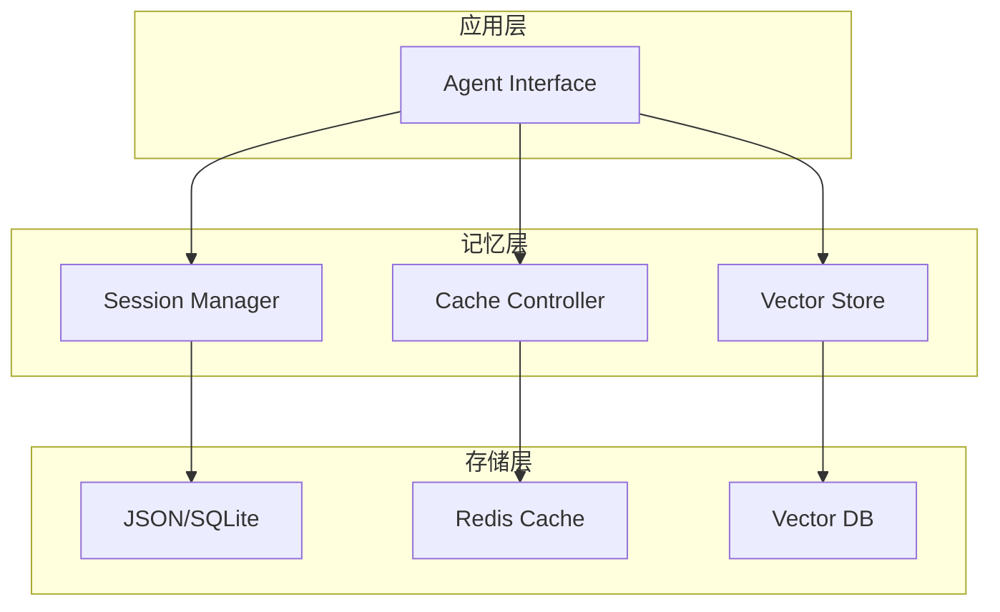

# 03. 最佳实践 - 生产环境指南

> 从原型到生产：记忆系统的工程化实践

## 🎯 本章目标

- 掌握生产级记忆系统设计
- 学习成本优化策略
- 了解性能调优技巧
- 建立监控和故障处理机制

---

## 1. 系统架构设计

### 1.1 分层架构



**设计原则**：
- 🔌 **解耦**：各组件独立，易于替换
- 📊 **可观测**：完善的日志和监控
- 🔄 **可扩展**：支持水平扩展
- 🛡️ **容错**：优雅处理故障

### 1.2 选型指南

#### Session 存储选型

| 方案 | QPS | 成本 | 适用规模 | 推荐场景 |
|------|-----|------|---------|---------|
| **JSON 文件** | < 10 | 免费 | < 1K 用户 | 原型、学习 |
| **SQLite** | < 100 | 免费 | < 10K 用户 | 中小应用 |
| **Redis** | > 10K | 中等 | < 1M 用户 | 高并发应用 |
| **PostgreSQL** | > 1K | 中等 | 无限制 | 企业级应用 |

#### 向量数据库选型

| 数据库 | 性能 | 易用性 | 成本 | 适用场景 |
|--------|------|--------|------|---------|
| **ChromaDB** | ⭐⭐⭐ | ⭐⭐⭐⭐⭐ | 免费 | 原型开发 |
| **FAISS** | ⭐⭐⭐⭐⭐ | ⭐⭐⭐ | 免费 | 本地高性能 |
| **Pinecone** | ⭐⭐⭐⭐ | ⭐⭐⭐⭐⭐ | 付费 | 云服务 |
| **Qdrant** | ⭐⭐⭐⭐ | ⭐⭐⭐⭐ | 免费/付费 | 生产环境 |
| **Weaviate** | ⭐⭐⭐⭐ | ⭐⭐⭐⭐ | 免费/付费 | 多模态 |

### 1.3 混合架构示例

```python
class ProductionMemorySystem:
    """生产级记忆系统"""
    
    def __init__(self, config: Dict):
        # 短期记忆：Redis（快速访问）
        self.redis_client = redis.Redis(
            host=config['redis_host'],
            port=config['redis_port'],
            db=0,
            decode_responses=True
        )
        
        # 长期记忆：PostgreSQL（持久化）
        self.db = psycopg2.connect(config['database_url'])
        
        # 语义记忆：向量数据库（相似度搜索）
        self.vector_db = QdrantClient(
            host=config['qdrant_host'],
            port=config['qdrant_port']
        )
    
    def get_context(self, session_id: str, query: str) -> Dict:
        """智能获取上下文"""
        context = {}
        
        # 1. 短期记忆（最近对话）- Redis
        recent_messages = self._get_recent_from_redis(session_id, limit=10)
        context['recent'] = recent_messages
        
        # 2. 长期记忆（重要历史）- PostgreSQL
        important_facts = self._get_important_from_db(session_id)
        context['facts'] = important_facts
        
        # 3. 语义记忆（相关知识）- Vector DB
        relevant_docs = self._semantic_search(query, top_k=3)
        context['knowledge'] = relevant_docs
        
        return context
    
    def save_message(self, session_id: str, message: Dict):
        """保存消息到多个存储"""
        # 1. 立即写入 Redis（快速访问）
        self._save_to_redis(session_id, message, ttl=3600)
        
        # 2. 异步写入 PostgreSQL（持久化）
        self._async_save_to_db(session_id, message)
        
        # 3. 如果是重要信息，向量化存储
        if self._is_important(message):
            self._save_to_vector_db(session_id, message)
```

---

## 2. 成本优化策略

### 2.1 Prompt Caching 最大化

**规则 1：缓存大块固定内容**

```python
# ❌ 不好：频繁变化的内容
messages = [
    {
        "role": "user",
        "content": f"当前时间: {datetime.now()}, 用户: {user_name}"  # 每次都变
    }
]

# ✅ 好：固定内容缓存，动态内容分离
messages = [
    {
        "role": "user",
        "content": [
            {
                "type": "text",
                "text": LARGE_SYSTEM_PROMPT,  # 固定，可缓存
                "cache_control": {"type": "ephemeral"}
            },
            {
                "type": "text",
                "text": f"当前时间: {datetime.now()}, 用户: {user_name}"  # 动态
            }
        ]
    }
]
```

**规则 2：合并缓存块**

```python
# ❌ 不好：多个小缓存块
cache_block_1 = "文档第 1 部分"  # 500 tokens
cache_block_2 = "文档第 2 部分"  # 600 tokens

# ✅ 好：单个大缓存块（> 1024 tokens）
combined_doc = f"{part1}\n\n{part2}\n\n{part3}"  # 3000 tokens
```

**规则 3：缓存生命周期管理**

```python
class CacheManager:
    """缓存管理器"""
    
    def __init__(self):
        self.cache_tracker = {}
    
    def should_refresh(self, cache_key: str) -> bool:
        """判断是否需要刷新缓存"""
        if cache_key not in self.cache_tracker:
            return True
        
        last_update = self.cache_tracker[cache_key]
        # TTL = 5 分钟，4 分钟后刷新
        return (datetime.now() - last_update).seconds > 240
    
    def mark_cached(self, cache_key: str):
        """标记缓存时间"""
        self.cache_tracker[cache_key] = datetime.now()
```

### 2.2 Token 使用优化

**策略 1：渐进式上下文加载**

```python
def get_progressive_context(session_id: str, query: str) -> List[Dict]:
    """渐进加载上下文"""
    context = []
    token_budget = 100_000
    used_tokens = 0
    
    # Level 1: 最近 5 条消息（必需）
    recent = get_recent_messages(session_id, limit=5)
    used_tokens += count_tokens(recent)
    context.extend(recent)
    
    # Level 2: 相关知识（如果有空间）
    if used_tokens < token_budget * 0.5:
        knowledge = vector_search(query, top_k=3)
        knowledge_tokens = count_tokens(knowledge)
        if used_tokens + knowledge_tokens < token_budget:
            context.extend(knowledge)
            used_tokens += knowledge_tokens
    
    # Level 3: 完整历史（如果还有空间）
    if used_tokens < token_budget * 0.7:
        full_history = get_all_messages(session_id)
        for msg in full_history:
            msg_tokens = count_tokens(msg)
            if used_tokens + msg_tokens < token_budget:
                context.append(msg)
                used_tokens += msg_tokens
            else:
                break
    
    logger.info(f"Context loaded: {used_tokens}/{token_budget} tokens")
    return context
```

**策略 2：智能摘要**

```python
async def summarize_old_messages(messages: List[Dict]) -> str:
    """异步摘要旧消息"""
    if len(messages) < 20:
        return None  # 太少不需要摘要
    
    # 只摘要旧消息（保留最近 10 条原文）
    old_messages = messages[:-10]
    
    summary_prompt = f"""
    请用 500 tokens 内总结以下对话的关键信息：
    - 主要讨论的话题
    - 重要的事实和决策
    - 用户的偏好和需求
    
    对话内容：
    {format_messages(old_messages)}
    """
    
    summary = await call_llm(summary_prompt, max_tokens=500)
    
    # 压缩率
    old_tokens = sum(count_tokens(m['content']) for m in old_messages)
    new_tokens = count_tokens(summary)
    compression_ratio = old_tokens / new_tokens
    
    logger.info(f"Summarized {len(old_messages)} messages: "
                f"{old_tokens} -> {new_tokens} tokens "
                f"({compression_ratio:.1f}x compression)")
    
    return summary
```

### 2.3 成本监控

```python
class CostTracker:
    """成本追踪器"""
    
    # Claude 3.5 Sonnet 定价（2024年1月）
    PRICING = {
        'input': 3.0,           # $3/M tokens
        'output': 15.0,         # $15/M tokens
        'cache_write': 3.75,    # $3.75/M tokens
        'cache_read': 0.30      # $0.30/M tokens
    }
    
    def __init__(self):
        self.usage_log = []
    
    def track(self, usage: Dict, session_id: str):
        """追踪 API 使用"""
        cost = {
            'session_id': session_id,
            'timestamp': datetime.now().isoformat(),
            'input_tokens': usage.get('input_tokens', 0),
            'output_tokens': usage.get('output_tokens', 0),
            'cache_read': usage.get('cache_read_input_tokens', 0),
            'cache_write': usage.get('cache_creation_input_tokens', 0)
        }
        
        # 计算费用
        cost['cost'] = (
            cost['input_tokens'] / 1_000_000 * self.PRICING['input'] +
            cost['output_tokens'] / 1_000_000 * self.PRICING['output'] +
            cost['cache_read'] / 1_000_000 * self.PRICING['cache_read'] +
            cost['cache_write'] / 1_000_000 * self.PRICING['cache_write']
        )
        
        self.usage_log.append(cost)
        
        # 实时告警
        if cost['cost'] > 1.0:  # 单次请求超过 $1
            logger.warning(f"⚠️  High cost request: ${cost['cost']:.2f}")
    
    def get_daily_cost(self, date: str = None) -> float:
        """获取每日成本"""
        if date is None:
            date = datetime.now().date().isoformat()
        
        daily_logs = [
            log for log in self.usage_log
            if log['timestamp'].startswith(date)
        ]
        
        return sum(log['cost'] for log in daily_logs)
    
    def get_cache_hit_rate(self) -> float:
        """计算缓存命中率"""
        total_input = sum(log['input_tokens'] for log in self.usage_log)
        cache_hits = sum(log['cache_read'] for log in self.usage_log)
        
        if total_input == 0:
            return 0.0
        
        return cache_hits / total_input
```

---

## 3. 性能优化

### 3.1 并发处理

```python
import asyncio
from concurrent.futures import ThreadPoolExecutor

class AsyncMemorySystem:
    """异步记忆系统"""
    
    def __init__(self):
        self.executor = ThreadPoolExecutor(max_workers=10)
    
    async def get_context_async(self, session_id: str, query: str) -> Dict:
        """并发获取上下文"""
        # 同时执行多个查询
        recent_task = asyncio.create_task(
            self._get_recent_async(session_id)
        )
        vector_task = asyncio.create_task(
            self._vector_search_async(query)
        )
        facts_task = asyncio.create_task(
            self._get_facts_async(session_id)
        )
        
        # 等待所有任务完成
        recent, vectors, facts = await asyncio.gather(
            recent_task,
            vector_task,
            facts_task
        )
        
        return {
            'recent': recent,
            'vectors': vectors,
            'facts': facts
        }
    
    async def _get_recent_async(self, session_id: str):
        """异步获取最近消息"""
        loop = asyncio.get_event_loop()
        return await loop.run_in_executor(
            self.executor,
            self._get_recent_sync,
            session_id
        )
```

### 3.2 缓存策略

```python
from functools import lru_cache
import hashlib

class SmartCache:
    """智能缓存层"""
    
    def __init__(self):
        self.local_cache = {}  # 进程内缓存
        self.redis = redis.Redis()  # 分布式缓存
    
    def get(self, key: str, fetcher: callable, ttl: int = 300):
        """多级缓存获取"""
        # L1: 进程内缓存（最快）
        if key in self.local_cache:
            logger.debug(f"Cache hit (L1): {key}")
            return self.local_cache[key]
        
        # L2: Redis 缓存
        cached = self.redis.get(key)
        if cached:
            logger.debug(f"Cache hit (L2): {key}")
            value = json.loads(cached)
            self.local_cache[key] = value  # 写入 L1
            return value
        
        # L3: 从源获取
        logger.debug(f"Cache miss: {key}")
        value = fetcher()
        
        # 写入所有缓存层
        self.local_cache[key] = value
        self.redis.setex(key, ttl, json.dumps(value))
        
        return value
    
    @lru_cache(maxsize=1000)
    def get_embedding_cached(self, text: str) -> List[float]:
        """缓存 embedding（避免重复计算）"""
        text_hash = hashlib.md5(text.encode()).hexdigest()
        cache_key = f"emb:{text_hash}"
        
        return self.get(
            cache_key,
            lambda: self._compute_embedding(text),
            ttl=86400  # 24 小时
        )
```

### 3.3 批量处理

```python
class BatchProcessor:
    """批量处理器（提升吞吐量）"""
    
    def __init__(self, batch_size: int = 10, flush_interval: float = 1.0):
        self.batch_size = batch_size
        self.flush_interval = flush_interval
        self.queue = []
        self.last_flush = time.time()
    
    async def add(self, item: Dict):
        """添加到批次队列"""
        self.queue.append(item)
        
        # 达到批次大小或超时，触发刷新
        should_flush = (
            len(self.queue) >= self.batch_size or
            time.time() - self.last_flush > self.flush_interval
        )
        
        if should_flush:
            await self.flush()
    
    async def flush(self):
        """批量处理队列"""
        if not self.queue:
            return
        
        batch = self.queue[:]
        self.queue = []
        self.last_flush = time.time()
        
        # 批量向量化
        texts = [item['text'] for item in batch]
        embeddings = await self._batch_embed(texts)
        
        # 批量插入向量数据库
        await self._batch_insert(batch, embeddings)
        
        logger.info(f"Flushed batch: {len(batch)} items")
    
    async def _batch_embed(self, texts: List[str]) -> List[List[float]]:
        """批量生成 embedding"""
        # 使用批量 API（更高效）
        return await embedding_service.embed_batch(texts)
```

---

## 4. 监控与可观测性

### 4.1 日志系统

```python
import logging
import structlog

# 结构化日志配置
structlog.configure(
    processors=[
        structlog.processors.TimeStamper(fmt="iso"),
        structlog.processors.JSONRenderer()
    ]
)

logger = structlog.get_logger()

class ObservableAgent:
    """可观测的 Agent"""
    
    def chat(self, session_id: str, message: str) -> str:
        logger.info(
            "chat_started",
            session_id=session_id,
            message_length=len(message)
        )
        
        start_time = time.time()
        
        try:
            # 获取上下文
            context_start = time.time()
            context = self.memory.get_context(session_id, message)
            context_time = time.time() - context_start
            
            logger.info(
                "context_loaded",
                session_id=session_id,
                context_size=len(context),
                duration_ms=context_time * 1000
            )
            
            # 调用 LLM
            llm_start = time.time()
            response = self.llm.generate(context, message)
            llm_time = time.time() - llm_start
            
            logger.info(
                "llm_completed",
                session_id=session_id,
                input_tokens=response.usage.input_tokens,
                output_tokens=response.usage.output_tokens,
                duration_ms=llm_time * 1000
            )
            
            total_time = time.time() - start_time
            
            logger.info(
                "chat_completed",
                session_id=session_id,
                total_duration_ms=total_time * 1000
            )
            
            return response.content
            
        except Exception as e:
            logger.error(
                "chat_failed",
                session_id=session_id,
                error=str(e),
                duration_ms=(time.time() - start_time) * 1000
            )
            raise
```

### 4.2 指标收集

```python
from prometheus_client import Counter, Histogram, Gauge

# Prometheus 指标
requests_total = Counter(
    'agent_requests_total',
    'Total number of agent requests',
    ['session_id', 'status']
)

request_duration = Histogram(
    'agent_request_duration_seconds',
    'Request duration',
    ['operation']
)

context_size = Histogram(
    'agent_context_size_tokens',
    'Context size in tokens'
)

cache_hit_rate = Gauge(
    'agent_cache_hit_rate',
    'Cache hit rate'
)

class MetricsAgent:
    """带指标收集的 Agent"""
    
    @request_duration.labels(operation='chat').time()
    def chat(self, session_id: str, message: str) -> str:
        try:
            context = self.get_context(session_id, message)
            
            # 记录上下文大小
            context_tokens = count_tokens(context)
            context_size.observe(context_tokens)
            
            response = self.llm.generate(context, message)
            
            # 记录成功请求
            requests_total.labels(
                session_id=session_id,
                status='success'
            ).inc()
            
            # 更新缓存命中率
            if hasattr(response.usage, 'cache_read_input_tokens'):
                hit_rate = (
                    response.usage.cache_read_input_tokens /
                    response.usage.input_tokens
                )
                cache_hit_rate.set(hit_rate)
            
            return response.content
            
        except Exception as e:
            requests_total.labels(
                session_id=session_id,
                status='error'
            ).inc()
            raise
```

### 4.3 告警机制

```python
class AlertManager:
    """告警管理器"""
    
    THRESHOLDS = {
        'high_cost': 10.0,          # 单日成本 > $10
        'low_cache_rate': 0.5,      # 缓存命中率 < 50%
        'slow_response': 5.0,       # 响应时间 > 5s
        'high_token_usage': 150000  # 单次请求 > 150K tokens
    }
    
    def check_health(self, metrics: Dict) -> List[str]:
        """健康检查"""
        alerts = []
        
        # 检查成本
        if metrics['daily_cost'] > self.THRESHOLDS['high_cost']:
            alerts.append(
                f"⚠️  Daily cost: ${metrics['daily_cost']:.2f} "
                f"(threshold: ${self.THRESHOLDS['high_cost']})"
            )
        
        # 检查缓存命中率
        if metrics['cache_hit_rate'] < self.THRESHOLDS['low_cache_rate']:
            alerts.append(
                f"⚠️  Low cache hit rate: {metrics['cache_hit_rate']:.1%} "
                f"(threshold: {self.THRESHOLDS['low_cache_rate']:.1%})"
            )
        
        # 检查响应时间
        if metrics['avg_response_time'] > self.THRESHOLDS['slow_response']:
            alerts.append(
                f"⚠️  Slow response: {metrics['avg_response_time']:.2f}s "
                f"(threshold: {self.THRESHOLDS['slow_response']}s)"
            )
        
        return alerts
    
    def send_alerts(self, alerts: List[str]):
        """发送告警"""
        if not alerts:
            return
        
        # 发送到 Slack/Email/PagerDuty
        message = "\n".join(alerts)
        logger.warning("health_check_alerts", alerts=message)
        
        # 实际发送逻辑
        # slack_client.send_message(channel='#alerts', text=message)
```

---

## 5. 错误处理与容错

### 5.1 重试机制

```python
from tenacity import (
    retry,
    stop_after_attempt,
    wait_exponential,
    retry_if_exception_type
)

class ResilientAgent:
    """容错 Agent"""
    
    @retry(
        stop=stop_after_attempt(3),
        wait=wait_exponential(multiplier=1, min=2, max=10),
        retry=retry_if_exception_type(
            (requests.exceptions.Timeout, anthropic.APIError)
        )
    )
    def call_llm_with_retry(self, messages: List[Dict]) -> str:
        """带重试的 LLM 调用"""
        try:
            response = self.client.messages.create(
                model="claude-3-5-sonnet-20241022",
                max_tokens=2048,
                messages=messages
            )
            return response.content[0].text
            
        except anthropic.RateLimitError as e:
            # 速率限制，等待后重试
            wait_time = int(e.response.headers.get('retry-after', 60))
            logger.warning(f"Rate limited, waiting {wait_time}s")
            time.sleep(wait_time)
            raise
            
        except anthropic.APIError as e:
            logger.error(f"API error: {e}")
            raise
```

### 5.2 降级策略

```python
class FallbackAgent:
    """带降级的 Agent"""
    
    def get_context(self, session_id: str, query: str) -> Dict:
        """多级降级获取上下文"""
        try:
            # 尝试完整策略（向量搜索 + 完整历史）
            return self._get_full_context(session_id, query)
            
        except VectorDBError:
            logger.warning("Vector DB unavailable, using fallback")
            # 降级 1：只用 session 历史
            try:
                return self._get_session_context(session_id)
            except SessionError:
                logger.error("Session store unavailable, using minimal context")
                # 降级 2：只用当前查询
                return {"messages": [{"role": "user", "content": query}]}
    
    def chat(self, session_id: str, message: str) -> str:
        """带降级的聊天"""
        try:
            # 主模型
            return self._call_claude(session_id, message)
            
        except anthropic.RateLimitError:
            # 降级到备用模型
            logger.warning("Claude rate limited, using fallback model")
            return self._call_fallback_model(session_id, message)
            
        except Exception as e:
            # 最终降级：固定回复
            logger.error(f"All models failed: {e}")
            return "抱歉，服务暂时不可用，请稍后重试。"
```

### 5.3 数据一致性

```python
class ConsistentMemory:
    """保证一致性的记忆系统"""
    
    def save_message(self, session_id: str, message: Dict):
        """带事务的消息保存"""
        transaction_id = str(uuid.uuid4())
        
        try:
            # 1. 写入 WAL (Write-Ahead Log)
            self._write_wal(transaction_id, session_id, message)
            
            # 2. 写入主存储
            self._write_to_primary(session_id, message)
            
            # 3. 写入缓存
            self._write_to_cache(session_id, message)
            
            # 4. 标记事务完成
            self._commit_transaction(transaction_id)
            
        except Exception as e:
            # 回滚
            logger.error(f"Save failed, rolling back: {e}")
            self._rollback_transaction(transaction_id)
            raise
    
    def recover(self):
        """从 WAL 恢复未完成的事务"""
        incomplete_txs = self._get_incomplete_transactions()
        
        for tx in incomplete_txs:
            logger.info(f"Recovering transaction: {tx['id']}")
            try:
                self._replay_transaction(tx)
                self._commit_transaction(tx['id'])
            except Exception as e:
                logger.error(f"Recovery failed: {e}")
                self._rollback_transaction(tx['id'])
```

---

## 6. 安全与隐私

### 6.1 数据加密

```python
from cryptography.fernet import Fernet

class SecureMemory:
    """安全的记忆系统"""
    
    def __init__(self, encryption_key: bytes):
        self.cipher = Fernet(encryption_key)
    
    def save_message(self, session_id: str, message: Dict):
        """加密保存消息"""
        # 序列化
        message_json = json.dumps(message)
        
        # 加密
        encrypted = self.cipher.encrypt(message_json.encode())
        
        # 保存加密数据
        self._write_encrypted(session_id, encrypted)
    
    def load_messages(self, session_id: str) -> List[Dict]:
        """解密加载消息"""
        # 读取加密数据
        encrypted = self._read_encrypted(session_id)
        
        # 解密
        decrypted = self.cipher.decrypt(encrypted)
        
        # 反序列化
        return json.loads(decrypted.decode())
```

### 6.2 敏感信息脱敏

```python
import re

class PrivacyFilter:
    """隐私过滤器"""
    
    PATTERNS = {
        'email': r'\b[A-Za-z0-9._%+-]+@[A-Za-z0-9.-]+\.[A-Z|a-z]{2,}\b',
        'phone': r'\b\d{3}[-.]?\d{3}[-.]?\d{4}\b',
        'credit_card': r'\b\d{4}[-\s]?\d{4}[-\s]?\d{4}[-\s]?\d{4}\b',
        'ssn': r'\b\d{3}-\d{2}-\d{4}\b'
    }
    
    def redact(self, text: str) -> str:
        """脱敏处理"""
        redacted = text
        
        for pii_type, pattern in self.PATTERNS.items():
            redacted = re.sub(
                pattern,
                f"[REDACTED_{pii_type.upper()}]",
                redacted
            )
        
        return redacted
    
    def filter_message(self, message: Dict) -> Dict:
        """过滤消息中的敏感信息"""
        filtered = message.copy()
        filtered['content'] = self.redact(message['content'])
        
        # 保存原始内容的哈希（用于审计）
        filtered['content_hash'] = hashlib.sha256(
            message['content'].encode()
        ).hexdigest()
        
        return filtered
```

---

## 7. 小结

### 生产环境检查清单

- [ ] **架构设计**
  - [ ] 分层解耦
  - [ ] 存储选型合理
  - [ ] 支持水平扩展

- [ ] **成本优化**
  - [ ] Prompt Caching 全覆盖
  - [ ] Token 使用监控
  - [ ] 成本告警机制

- [ ] **性能调优**
  - [ ] 异步并发处理
  - [ ] 多级缓存
  - [ ] 批量处理

- [ ] **可观测性**
  - [ ] 结构化日志
  - [ ] Metrics 收集
  - [ ] 告警系统

- [ ] **容错能力**
  - [ ] 重试机制
  - [ ] 降级策略
  - [ ] 数据一致性

- [ ] **安全合规**
  - [ ] 数据加密
  - [ ] 敏感信息脱敏
  - [ ] 访问控制

### 推荐技术栈

| 组件 | 开发环境 | 生产环境 |
|------|---------|---------|
| **Session** | JSON | Redis + PostgreSQL |
| **Vector DB** | ChromaDB | Qdrant / Pinecone |
| **监控** | Print | Prometheus + Grafana |
| **日志** | Logging | Structlog + ELK |
| **部署** | 本地 | Docker + K8s |

---

## 下一步

开始实战项目，将这些最佳实践应用到实际开发中：
- **[Project 1: Session Manager](../projects/project_01_session_manager/)** - 基础会话管理
- **[Project 2: Cached QA Bot](../projects/project_02_cached_qa_bot/)** - 成本优化实战
- **[Project 3: Vector Memory](../projects/project_03_vector_memory/)** - 长期记忆系统
- **[Project 4: Context Compressor](../projects/project_04_context_compressor/)** - 上下文压缩优化
