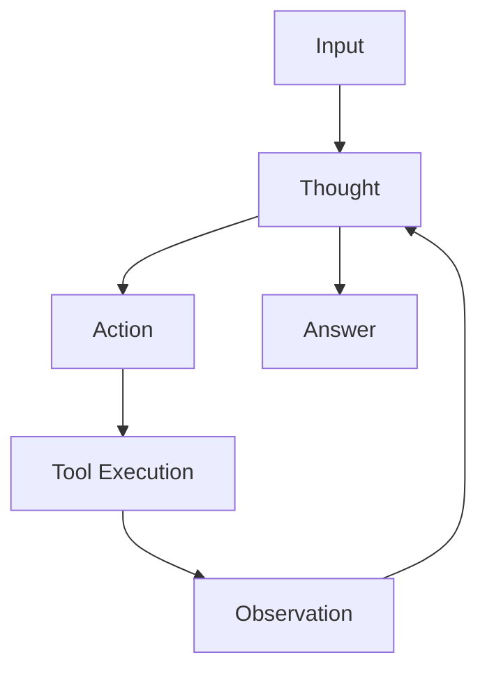
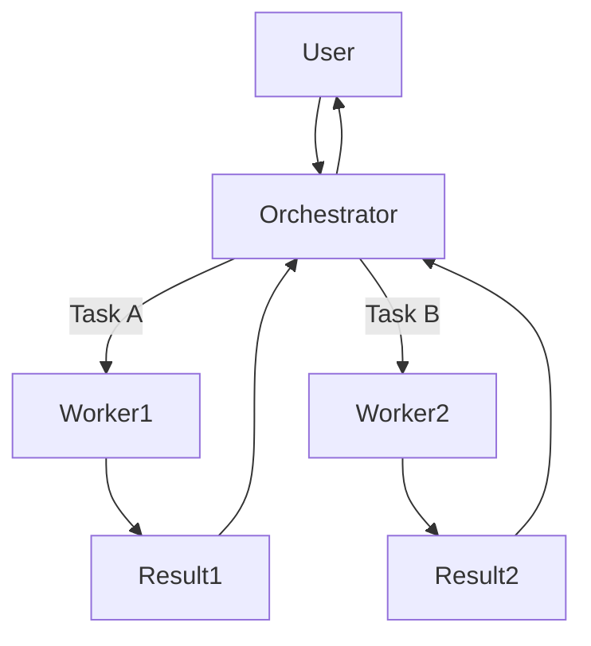

# Module 7: Planning & Orchestration - 规划与编排

> **Phase 3: 智慧 (Intelligence)**
> 学习如何构建能够处理复杂任务、自我纠错并与人类紧密协作的高级 Agent 系统。

## 📚 学习目标

完成本模块后，你将能够：
- [ ] 理解并实现 **ReAct (Reasoning + Acting)** 循环
- [ ] 掌握 **Chain of Thought (CoT)** 提示技术
- [ ] 构建 **Human-in-the-loop (HIL)** 系统，实现安全的人机协作
- [ ] 设计 **Orchestrator-Workers** 模式来解决复杂任务

## 📖 内容概览

### 文档 (docs/)
1. [01_架构模式.md](docs/01_架构模式.md) - ReAct, CoT 与规划算法
2. [02_人机协作.md](docs/02_人机协作.md) - Human-in-the-loop 设计模式
3. [03_多Agent编排.md](docs/03_多Agent编排.md) - 复杂系统分层架构

### 实战项目 (projects/)
1. **[project_01_react_agent](projects/project_01_react_agent/)** - **ReAct 引擎**
   - 从零手写一个能够使用工具、分析结果并从错误中恢复的 Agent 运行时。
   
2. **[project_02_travel_planner](projects/project_02_travel_planner/)** - **旅行规划师**
   - 学习如何让 Agent 生成多步计划，并逐步执行复杂的预订任务。

3. **[project_03_human_feedback](projects/project_03_human_feedback/)** - **审批助手**
   - 构建一个敏感操作（如发邮件、转账）需要人类审批介入的系统。

4. **[project_04_orchestrator_workers](projects/project_04_orchestrator_workers/)** - **研报生成团队**
   - 一个 Orchestrator 负责规划，指挥 Researcher 和 Writer 两个子 Agent 协作完成报告。

## ⏱️ 预计学习时间
- 理论学习：2 小时
- 实战项目：5-6 小时

## 🧠 核心概念剧透

### ReAct Loop

### Orchestrator-Workers

---

## 下一步
开始阅读 [01_架构模式.md](docs/01_架构模式.md) 了解 Agent 是如何"思考"的。
