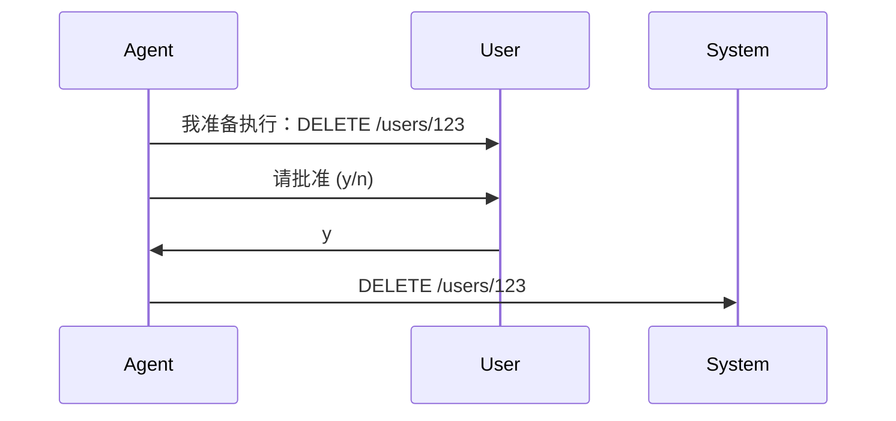
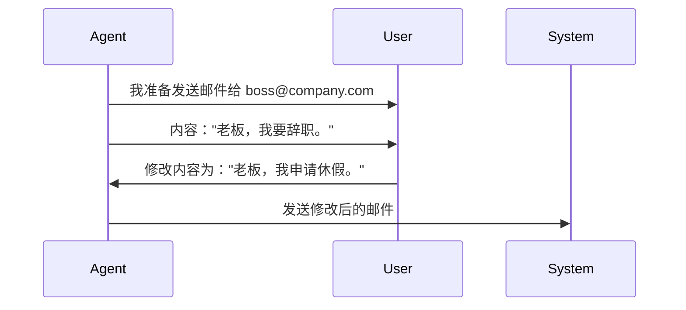

# 02. 人机协作 (Human-in-the-loop)

> "AI 应该增强人类的能力，而不是完全取代人类的判断。"

## 1. 为什么需要 HIL？

全自动的 Agent 虽然高效，但在以下场景中是危险或不合适的：
- **高风险操作**: 转账、删除生产环境数据库、发送全员邮件。
- **模糊决策**: 需要人类的主观审美或偏好判断（如"这张图设计得好吗？"）。
- **缺乏上下文**: Agent 遇到了训练数据或工具无法覆盖的边缘情况。

Human-in-the-loop (HIL) 允许 Agent 在特定时刻暂停，请求人类介入，然后根据人类的反馈继续（或终止）。

## 2. HIL 的实现模式

### 模式 A: 审批 (Approval)
最简单的模式。Agent 在执行关键 Action 之前暂停。



### 模式 B: 修改 (Correction)
人类不仅批准，还可以修改 Agent 的参数。



### 模式 C: 求助 (Escalation)
Agent 尝试失败或不确定时主动求助。

*   **Agent**: "我尝试了搜索，但没找到相关文档。请问您有具体的链接吗？或者我应该换个关键词？"
*   **User**: "试一下搜 'API v2 spec'。"

## 3. 技术实现细节

在代码层面，HIL 通常意味着打破 `Run Loop`：

```python
# 伪代码示例

while True:
    thought = agent.think()
    action = agent.decide_action(thought)
    
    if action.is_sensitive:
        # --- 暂停 ---
        print(f"请求批准: {action}")
        user_feedback = input("是否批准？(y/n/改写): ")
        
        if user_feedback == 'n':
            memory.add("User rejected the action.")
            continue
        elif user_feedback != 'y':
            action.params = parse(user_feedback)
            
    # --- 继续 ---
    result = execute(action)
    memory.add(result)
```

## 4. 最佳实践

1.  **明确的边界**: 清晰定义哪些操作是"敏感"的。读取操作通常安全，写入/删除操作需要审批。
2.  **提供充分上下文**: 请求审批时，告诉用户 *为什么* 要做这个，以及 *后果* 是什么。
3.  **超时处理**: 如果用户一直不回复怎么办？通常应设定默认行为（如自动取消）。
4.  **UI/UX**: 对于终端用户，不要展示 JSON。用友好的 UI 展示待审批事项。

在 **Project 3** 中，我们将构建一个带有这种机制的敏感操作助手。
