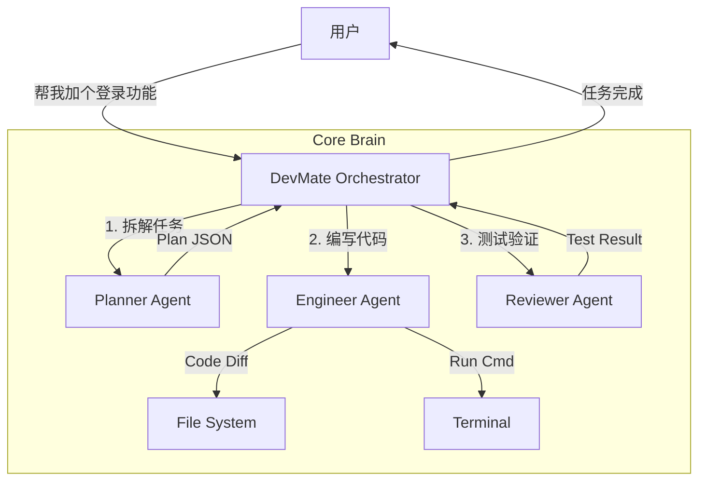

# 01. DevMate 系统设计

> "DevMate 不仅仅是一个工具，它是你的 AI 结对编程伙伴。"

## 1. 核心架构：Orchestrator-Workers

为了处理复杂的开发任务，DevMate 采用了分层架构：

## 2. Agent 职责定义

### 🧠 Planner (规划者)
不直接操作文件，负责思考和拆解。
- **输入**: 用户模糊的需求 ("重构这块代码")
- **上下文**: 项目目录结构 (`tree`), 关键文件内容
- **输出**: 结构化的步骤列表 (Standard Operating Procedure)

### 🛠️ Engineer (工程师)
实干家，负责执行 Planner 的每一步。
- **工具**:
    - `read_file(path)`
    - `apply_patch(path, diff)` (比全量写入更安全)
    - `run_shell(cmd)`
- **特点**: 每执行一步后，都要观察通过 Terminal 返回的结果。

### 🔍 Reviewer (审查者)
质量把关。
- **职责**: 运行测试，检查代码风格，确保没有引入显而易见的 bug。
- **决策**: 如果测试失败，打回给 Engineer 修复。

## 3. 记忆系统 (Memory)

DevMate 维护两种记忆：

1.  **Project Context (短期)**:
    -   当前项目的目录结构
    -   已读取的文件内容缓存
    -   当前任务的执行进度

2.  **User Preferences (长期)**:
    -   用户喜欢的代码风格 (e.g., "Use snake_case")
    -   项目特定的规范 (e.g., "Always add type hints")
    -   存储在 `.devmate/config.json`

## 4. 安全机制 (Safety)

DevMate 拥有强大的权限，必须加以限制：

1.  **Human Confirmation**: 写文件和执行 Shell 命令前，默认需要用户按下 `Y`。
2.  **Sandboxing**: 限制只能访问项目根目录及以下的文件。
3.  **Backup**: 修改文件前自动创建 `.bak` 备份。

## 5. 技术栈选择

-   **Runtime**: Python 3.10+
-   **Model**: Claude 3.5 Sonnet (强推理能力)
-   **CLI**: `Typer` (极佳的开发体验) + `Rich` (优美的终端 UI)
-   **Config**: `Pydantic` + `Dotenv`
